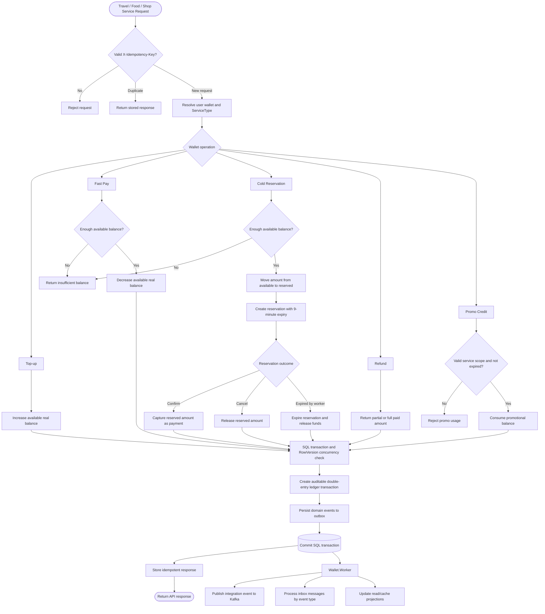
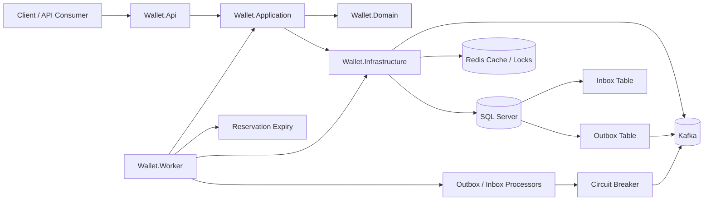

# Fintech Wallet Service

> Note
>
> This repository is a code sample demonstrating the coding style and software architecture approach of Amirhossein Tohidi.
> It was created as a technical portfolio project to showcase implementation practices, Clean Architecture structure, and microservice development patterns.

A production-minded wallet service sample built with Clean Architecture, CQRS, SQL Server, EF Core, Dapper-ready read models, Kafka integration, Redis-ready caching, idempotency, optimistic concurrency, and the transactional outbox pattern.

The project is designed as a portfolio-grade fintech backend, with special attention to financial consistency, multi-instance hosting, and operational reliability.

## Problem Statement Covered

This project is based on a wallet-system design exercise. The requested system is a shared `Wallet Service` that can be used by multiple business services, such as travel, food ordering, and shop/marketplace services, to manage user money safely.

The exercise asks for a design that supports:

- `Top-up`: adding funds to a user's wallet.
- `Hot Transaction`: an immediate payment where the amount is deducted from the wallet right away.
- `Cold Transaction`: reserving an amount by reducing available balance without spending it yet.
- `Confirm`: converting a cold transaction into a completed payment.
- `Cancel`: releasing a previously reserved amount.
- `Refund`: returning part or all of a paid amount.
- `Expiration`: automatically releasing unconfirmed cold transactions after their expiry time.
- `Promo Balance`: promotional credit with an expiry date and optional service-specific usage rules.
- `Concurrency Control`: safely handling concurrent withdrawals, reservations, retries, and multiple services operating on the same user wallet.
- `Idempotency`: preventing duplicated financial transactions when clients or gateways retry requests.
- `Financial Correctness`: keeping all transactions auditable and reliable under high load, preferably through a double-entry ledger model.

The expected design discussion includes high-level architecture, domain modeling with entities and aggregates, the main flows for top-up, reserve-confirm/cancel, direct payment and expiry, and the strategies used to prevent double spending while preserving financial correctness.

The implementation in this repository chooses the following model:

- One shared real wallet balance per user.
- Every financial operation records the target `ServiceType`.
- Promo credit is stored separately and can be scoped to one `ServiceType`.
- Auditability is provided through ledger transactions and ledger entries.

This avoids fragmented balances per service while still keeping service-level audit, reporting, and promo rules.

## Requirement Mapping

| Requirement from the exercise | Implementation |
| --- | --- |
| Shared wallet for travel, food ordering, and shop services | One wallet per user, every operation carries `ServiceType`. |
| Top-up | `POST /api/v1/wallet/users/{userId}/topups` and `UserWallet.TopUp`. |
| Fast Pay / immediate payment | `POST /api/v1/wallet/{walletId}/services/{serviceType}/fast-pay` and `UserWallet.Pay`. |
| Cold transaction / reservation | `POST /api/v1/wallet/{walletId}/services/{serviceType}/reservations` and `UserWallet.CreateReservation`. |
| Confirm cold transaction | `POST /api/v1/wallet/{walletId}/reservations/{reservationId}/confirm` and `UserWallet.ConfirmReservation`. |
| Cancel cold transaction | `POST /api/v1/wallet/{walletId}/reservations/{reservationId}/cancel` and `UserWallet.CancelReservation`. |
| Reservation expiry | 9-minute expiry plus `ReservationExpiryWorker`. |
| Refund | `POST /api/v1/wallet/{walletId}/services/{serviceType}/refunds` and `UserWallet.Refund`. |
| Real balance visibility | `GET /api/v1/wallet/{walletId}/balance`. |
| Promo balance with service scope and expiry | `PromoGrant` plus `GET /api/v1/promo/{walletId}/services/{serviceType}/promo-balances`. |
| Double spending prevention | SQL transaction, `RowVersion`, idempotency, and ledger constraints. |
| Duplicate transaction prevention | `X-Idempotency-Key` and `IdempotencyRequest`. |
| Auditability | `LedgerTransaction`, `LedgerEntry`, outbox events, and transaction read model. |

## Key Flows

### Top-up

1. Client sends a top-up command with `X-Idempotency-Key`.
2. The wallet aggregate increases real available balance.
3. A double-entry ledger transaction is created.
4. Domain events are persisted to the outbox.

### Hot Payment

1. Client sends `ServiceType` and amount.
2. The wallet aggregate immediately decreases available real balance.
3. The transaction is recorded with the target service.
4. The ledger records movement from wallet to spent account.

### Cold Reservation

1. Client reserves an amount for a specific service.
2. Available balance decreases.
3. Reserved balance increases.
4. The reservation expires after 9 minutes unless confirmed.
5. Confirm captures the reservation.
6. Cancel or expiry releases the amount.

### Promo Credit

1. Promo grants are scoped to one service type.
2. Expired promo credit is not usable.
3. Promo credit is tracked separately from real balance.
4. Remaining, consumed, and expiry values are available through the promo balance query.

## Business Process Flow



## Goals

- Model wallet operations through a rich domain model.
- Keep write operations strongly consistent.
- Use double-entry ledger records for financial traceability.
- Support safe retries through idempotency keys.
- Prepare the service for horizontal scaling across multiple instances.
- Publish integration events reliably through an outbox processor.
- Keep command and query paths separate through CQRS.
- Apply DDD tactical patterns around wallet aggregates and ledger behavior.
- Use BDD-friendly behavior names and scenario-driven tests as the testing direction.
- Protect external dependencies such as Kafka through a circuit breaker.
- Support hot transactions, cold transactions, refunds, real balance, and promo balance visibility.

## Architecture



## Project Structure

| Project | Responsibility |
| --- | --- |
| `Wallet.Domain` | Aggregates, entities, enums, domain events, and business rules. |
| `Wallet.Application` | CQRS commands, handlers, abstractions, result model, and use cases. |
| `Wallet.Infrastructure` | EF Core, SQL Server persistence, Redis, Kafka publisher, outbox/inbox storage, and resilience services. |
| `Wallet.Contracts` | Public request and integration event contracts. |
| `Wallet.Api` | Minimal API endpoints, middlewares, configuration, and HTTP pipeline. |
| `Wallet.Worker` | Dedicated worker process for outbox, inbox, dead-letter retries, and reservation expiry. |
| `tests/Wallet.UnitTests` | Unit tests for domain behavior, application handlers, mapping, validators, and infrastructure resilience. |
| `tests/Wallet.PropertyTests` | FsCheck property tests for domain invariants such as ledger balancing, wallet balance conservation, and promo credit consumption. |
| `tests/Wallet.ArchitectureTests` | NetArchTest rules that protect Clean Architecture dependency direction between domain, contracts, application, infrastructure, API, and worker projects. |
| `tests/Wallet.IntegrationTests` | Testcontainers-backed integration tests for API, SQL Server persistence, Redis projections, idempotency, concurrency, and worker jobs. |
| `tests/Wallet.AcceptanceTests` | Reqnroll/Gherkin acceptance scenarios for business-readable wallet behavior. |

## Core Capabilities

- Top up wallet balance.
- Pay immediately through a hot transaction.
- Reserve funds.
- Confirm reservations.
- Cancel reservations.
- Refund full or partial amounts.
- Track service-scoped promo credit.
- Expose real wallet balance.
- Expose promo balance by service and expiry.
- Expire reservations through a background worker.
- Persist domain events into an outbox table.
- Publish outbox messages to Kafka through `Wallet.Worker`.
- Store inbox messages for future idempotent consumers.
- Cache wallet projections in Redis when Redis is enabled.

## Consistency Model

The write path is designed around the following rules:

- SQL Server is the source of truth.
- Wallet changes go through the `UserWallet` aggregate.
- `RowVersion` is used for optimistic concurrency.
- Idempotency is enforced for financial HTTP requests.
- Domain events are stored in the outbox in the same database transaction as wallet changes.
- Kafka publishing happens asynchronously through the dedicated `Wallet.Worker` process.
- Redis is used only as a cache or helper infrastructure, never as the financial source of truth.

## Background Processing

Background jobs are hosted in `Wallet.Worker`, not in the API or Infrastructure project. The worker uses `BackgroundService` with SQL-backed claiming, locks, retry limits, and dead-letter processing. This keeps the sample lightweight and explicit while still supporting multi-instance execution.

Inbox processing uses a strategy per `IntegrationEventType`. Each registered `IInboxMessageHandler` owns one event type, deserializes the matching typed integration envelope, validates the event type, and then runs the event-specific consumption logic.

Hangfire and Quartz are intentionally not used at this stage. Hangfire would add its own persistence schema and dashboard for a problem that is already naturally modeled by the outbox/inbox tables. Quartz is useful for complex calendar-based scheduling, but these jobs are polling processors with database-based coordination. If the service later needs business calendars, cron-driven campaign processing, or operator-managed schedules, Quartz can be introduced in `Wallet.Worker` without changing the domain or API layers.

## Multi-instance Readiness

The service is prepared to run multiple API instances:

- Idempotency records are stored in SQL Server with a unique key.
- Outbox messages are claimed with `LockedBy` and `LockedUntil`.
- `Wallet.Worker` instances can run in parallel without processing the same outbox, inbox, or expiry item concurrently.
- Reservation expiry handles concurrency conflicts and skips records already processed by another instance.
- Kafka producer idempotence is enabled when Kafka publishing is enabled.
- Kafka publishing is protected by a circuit breaker to avoid repeatedly calling an unhealthy dependency.

## DDD and BDD

The domain model is intentionally behavior-focused:

- `UserWallet` owns wallet invariants.
- Ledger operations are created through domain behavior.
- Reservation state changes go through aggregate methods.
- Domain events describe meaningful business facts.

Testing should follow BDD-style scenario naming:

- `GivenWalletHasBalance_WhenFundsAreReserved_ThenAvailableBalanceDecreases`
- `GivenReservationIsCreated_WhenReservationIsConfirmed_ThenReservedBalanceIsCaptured`
- `GivenSameIdempotencyKey_WhenRequestIsRetried_ThenPreviousResponseIsReturned`

## CQRS

Write operations use:

- `MediatR`
- EF Core
- Domain aggregates
- SQL Server transactions

Read operations are intentionally separated and prepared for:

- Dapper-based SQL read models
- Redis cache projections
- Optional analytical read stores such as ClickHouse or MongoDB

## API Endpoints

All financial endpoints require an `X-Idempotency-Key` header.

| Method | Route | Description |
| --- | --- | --- |
| `POST` | `/api/v1/wallet/users/{userId}/topups` | Adds funds to a user's wallet. |
| `POST` | `/api/v1/wallet/{walletId}/services/{serviceType}/fast-pay` | Performs Fast Pay immediate payment. |
| `POST` | `/api/v1/wallet/{walletId}/services/{serviceType}/reservations` | Reserves funds from a wallet for 9 minutes. |
| `POST` | `/api/v1/wallet/{walletId}/reservations/{reservationId}/confirm` | Captures a reservation. |
| `POST` | `/api/v1/wallet/{walletId}/reservations/{reservationId}/cancel` | Cancels a reservation and releases funds. |
| `POST` | `/api/v1/wallet/{walletId}/services/{serviceType}/refunds` | Refunds part or all of an amount. |
| `POST` | `/api/v1/promo/{walletId}/services/{serviceType}/promo-grants` | Adds service-scoped promo credit. |
| `POST` | `/api/v1/promo/{walletId}/services/{serviceType}/promo-consumptions` | Consumes service-scoped promo credit. |
| `GET` | `/api/v1/wallet/{walletId}/balance` | Returns real available and reserved balance. |
| `GET` | `/api/v1/promo/{walletId}/services/{serviceType}/promo-balances` | Returns promo grants, remaining amounts, usage, and expiry for a service. |
| `GET` | `/api/v1/wallet/{walletId}/services/{serviceType}/transactions` | Returns wallet ledger transactions for a service. |

## Configuration

Default local configuration uses SQL Server Windows Authentication:

```json
{
  "ConnectionStrings": {
    "Default": "Server=localhost;Database=FintechWalletDb;Trusted_Connection=True;TrustServerCertificate=True;MultipleActiveResultSets=true"
  }
}
```

Kafka and Redis are disabled by default so the service can run locally without external dependencies:

```json
{
  "Kafka": {
    "Enabled": false,
    "BootstrapServers": "localhost:9092",
    "Topic": "wallet.domain-events"
  },
  "Redis": {
    "Enabled": false,
    "Configuration": "localhost:6379"
  },
  "CircuitBreaker": {
    "FailureThreshold": 5,
    "BreakDurationSeconds": 30
  }
}
```

## Database

Create or update the SQL Server schema:

```bash
dotnet ef database update \
  --project src/Wallet.Infrastructure/Wallet.Infrastructure.csproj \
  --startup-project src/Wallet.Api/Wallet.Api.csproj
```

Add a new migration:

```bash
dotnet ef migrations add MigrationName \
  --project src/Wallet.Infrastructure/Wallet.Infrastructure.csproj \
  --startup-project src/Wallet.Api/Wallet.Api.csproj \
  --output-dir Persistence/Migrations
```

## Run Locally

```bash
dotnet restore
dotnet build
dotnet run --project src/Wallet.Api/Wallet.Api.csproj
```

Run background processors separately:

```bash
dotnet run --project src/Wallet.Worker/Wallet.Worker.csproj
```

Open API documentation in development:

- OpenAPI: `/openapi/v1.json`
- Scalar UI: `/scalar/v1`

## Tests

Run unit tests:

```bash
dotnet test tests/Wallet.UnitTests/Wallet.UnitTests.csproj
```

Run property tests:

```bash
dotnet test tests/Wallet.PropertyTests/Wallet.PropertyTests.csproj
```

Run architecture tests:

```bash
dotnet test tests/Wallet.ArchitectureTests/Wallet.ArchitectureTests.csproj
```

Run integration tests:

```bash
dotnet test tests/Wallet.IntegrationTests/Wallet.IntegrationTests.csproj
```

Run acceptance tests:

```bash
dotnet test tests/Wallet.AcceptanceTests/Wallet.AcceptanceTests.csproj
```

Integration and acceptance tests use Testcontainers and require Docker Desktop or a compatible Docker engine. They start isolated SQL Server and Redis containers, apply EF Core migrations, run the API through `WebApplicationFactory`, and start `Wallet.Worker` hosts for worker-specific scenarios.

Current integration coverage includes:

- Full API flow for top-up, Fast Pay, refund, reservation, confirmation, promo grant, promo consumption, balance query, promo balance query, and transaction query.
- HTTP idempotency replay, conflict handling, validation retry behavior, and missing idempotency-key validation.
- Concurrent requests using the same idempotency key.
- Concurrent distinct payment requests that must not overspend a wallet.
- Outbox processor behavior.
- Inbox processor behavior and Redis projection writing.
- Reservation expiry worker behavior.

The API integration test host removes all `IHostedService` registrations so API tests do not accidentally start background workers. Worker behavior is tested separately by starting an explicit `Wallet.Worker` host with test configuration.

Acceptance tests use Reqnroll with Gherkin feature files. They are intended for business-readable scenarios, while integration tests remain more detailed and technical.

## Example Request

```http
POST /api/v1/wallet/users/4fc1f3f8-66dc-4d75-8c2e-985d59ed45d4/topups
X-Idempotency-Key: 2f0d1b7f-71f7-4b62-a490-0aab4ec6ef77
Content-Type: application/json

{
  "amount": 100000
}
```

## Engineering Standards

- Clean Architecture boundaries must remain explicit.
- Domain rules stay in the domain model.
- Application handlers orchestrate use cases.
- Infrastructure implements technical details.
- Financial flows must be idempotent.
- Expected business failures should use `Result` instead of exceptions.
- Use named arguments for sensitive domain method calls.
- Write paths must be transactionally safe.
- Read paths should not mutate state.

## Current Status

Implemented:

- Clean Architecture project structure
- CQRS command handlers
- Dapper-based query handlers for balance, promo balances, and transaction history
- SQL Server EF Core persistence
- Idempotency middleware
- Optimistic concurrency with `RowVersion`
- Double-entry ledger model
- Hot transaction payment
- Cold transaction reservation with 9-minute expiry
- Service-scoped promo credit
- Refund operation
- Outbox and inbox tables
- Multi-instance-safe outbox processor
- Reservation expiry worker
- Kafka publisher
- Redis connection, cache, and lock services
- Circuit breaker for Kafka publishing
- Initial EF Core migration
- Unit test coverage for domain, application, contracts, validation, mapping, queries, commands, and circuit breaker behavior
- FsCheck property test coverage for ledger, wallet balance, reservation, and promo-credit invariants
- Architecture test coverage for Clean Architecture project dependency rules
- Integration test coverage for API flows, idempotency, concurrency, SQL Server persistence, Redis projections, outbox/inbox processing, and reservation expiry
- Acceptance test coverage for Gherkin wallet money-movement scenarios

Planned next:

- Result-based domain/application error flow
- Kafka consumers with inbox processing
- gRPC contracts for internal service communication
- Observability with structured logs, metrics, and tracing

## License

This project is licensed under the terms of the repository license.


